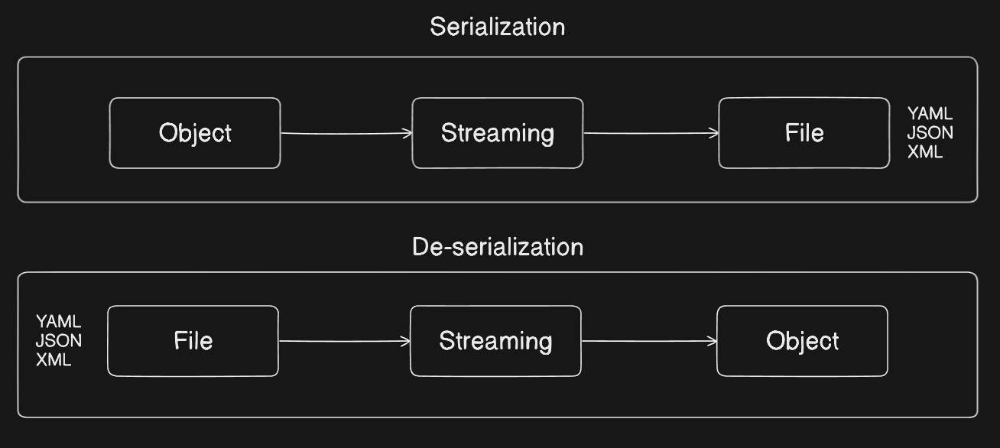

# YAML Repository

This repository contains resources to help you understand YAML and its syntax. It includes the following files:

## Files

- **syntax.yaml**: A YAML file that contains various YAML syntax examples. This file serves as a reference for understanding how to structure YAML files, including key-value pairs, lists, nested structures, and more.

## Purpose

The purpose of this repository is to provide a quick reference and guide for those who are new to YAML or need a refresher on its syntax and usage.

## YAML

**Previously known as** "Yet Another Markup Language" **& now known as** "YAML ain't markup language"

## What is a Markup Language?

A markup language is a system for annotating a document in a way that is syntactically distinguishable from the text. The annotations typically describe the document's structure, formatting, and how it should be displayed or interacted with. Markup languages use a set of predefined tags or symbols to identify elements within the document.

### Key Characteristics of Markup Languages:

1. **Tags and Elements**: Markup languages use tags to denote different elements. Tags are often enclosed in angle brackets, such as `<tagname>`. These elements can define sections, headings, links, images, and other components of the document.

2. **Attributes**: Tags can have attributes, which provide additional information about elements. For example, `` uses `src` and `alt` attributes to specify the image source and alternative text.

3. **Hierarchy**: Markup languages often use a nested, hierarchical structure to represent the document's organization. For example, HTML uses a tree-like structure with parent and child elements.

### Common Examples of Markup Languages:

1. **HTML (HyperText Markup Language)**: Used to create and structure content on the web. It defines the structure of web pages using elements like headings, paragraphs, links, images, and more.

2. **XML (eXtensible Markup Language)**: A flexible markup language used to store and transport data. It is both human-readable and machine-readable and is often used for data interchange between systems.

3. **Markdown**: A lightweight markup language with plain text formatting syntax, designed to be easy to read and write. It is often used for writing formatted text on the web, such as in readme files or forum posts.

### Usage of Markup Languages:

- **Web Development**: HTML is the backbone of web development, providing the structure for web pages.
- **Data Interchange**: XML is widely used for data exchange between different systems and platforms.
- **Documentation**: Markdown is popular for writing documentation, especially in software development, due to its simplicity and readability.

## Object

It represents a real-world entity or a concept that has a distinct identity, properties (attributes or data), and behaviors (methods or functions). Objects are instances of classes, which can be thought of as blueprints for creating objects.

## Stream

Streaming in serialization refers to the process of converting an object's state into a format that can be easily stored or transmitted, and then reconstructing the object from that format. In this context, streaming typically involves writing the serialized data to a stream (a sequence of data elements made available over time) and reading from that stream to deserialize the data back into an object.

## Serialization and De-serialization Diagram

## Tools to Validate YAML Files

1. **Datree**: [https://app.datree.io/login](https://app.datree.io/login)
2. **Monokle**: [https://monokle.io/](https://monokle.io/)
3. **Lens**: [https://docs.k8slens.dev/](https://docs.k8slens.dev/)

